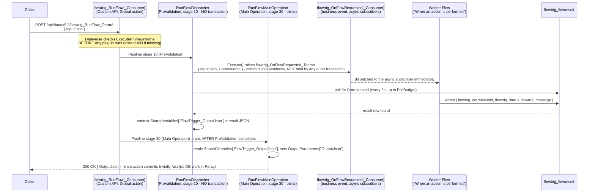

# PowerAutomate-PluginTrigger

A reference implementation for triggering Power Automate flows **synchronously** from
inside the Dataverse request pipeline, while keeping the entire call behind Dataverse's
own IP-firewall and security model. The pattern uses a caller-facing Custom API, a
business event, and a polling plug-in to bridge Power Automate's asynchronous execution
model back into a single request/response for the caller.

## Documentation

- [docs/ARCHITECTURE.md](docs/ARCHITECTURE.md) — component reference, Custom API field values, and the two-stage plug-in transaction design.
- [docs/PERMISSIONS.md](docs/PERMISSIONS.md) — caller-access models, trigger-picker visibility controls, and security notes.

## Goal

Trigger a Power Automate flow **synchronously** — the caller gets the flow's actual
result back in the same HTTP request/response — from a caller that can only reach the
Dataverse Web API, not an arbitrary flow HTTP trigger URL.
[Dataverse's IP firewall](https://learn.microsoft.com/power-platform/admin/ip-firewall)
doesn't protect a flow's own HTTP trigger endpoint, so when a caller's IP restrictions
must gate the integration, the trigger has to be a **Dataverse message** instead. A
plug-in raises a **business event** that a worker flow subscribes to, then polls for
that flow's result and returns it in the same request — bridging Power Automate's
asynchronous trigger model back into a single synchronous response for the caller. See
[docs/ARCHITECTURE.md](docs/ARCHITECTURE.md#why-a-dataverse-trigger-not-an-http-trigger)
for the full rationale.

## How it works (architecture)



`RunFlowDispatcher` and `RunFlowMainOperation` answer the same
`flowtrig_RunFlow[_Consumer]` message in different pipeline stages. See
[docs/ARCHITECTURE.md](docs/ARCHITECTURE.md#two-stage-plug-in-design)
for the transaction model, deadlock mechanism, and the `AllowedCustomProcessingStepType`
constraint that makes the split load-bearing.

## Repo layout

```
plugin/                          Dataverse plug-in (.NET Framework 4.6.2 class library)
  RunFlowDispatcher.cs           PreValidation-stage dispatcher (auth checks, raise event, poll) - routes by context.MessageName
  RunFlowMainOperation.cs        Main-Operation-stage relay (trivial: SharedVariables -> OutputParameters)
  FlowTrigger.Plugins.csproj
  New-StrongNameKey.ps1          Generates the (gitignored) signing key; runs automatically on build

deploy/
  DvHelper.psm1                  Dataverse Web API helpers (auth, idempotent CRUD, error surfacing) - uses Invoke-WebRequest (-UseBasicParsing) for broad PowerShell version compatibility, incl. Windows PowerShell 5.1
  Deploy-FlowTriggerSolution.ps1 Deploys/updates ONE environment (idempotent - safe to re-run); auto-repairs the allowedcustomprocessingsteptype=0 legacy issue
  Deploy-ToAllEnvironments.ps1   Loops the above over multiple environments, reports pass/fail per env
  Create-WorkerFlow.ps1          Creates + activates a real Power Automate worker flow for one consumer directly via the workflow Web API (needs a pre-existing, interactively-consented connection)
  Invoke-FlowTrigger.ps1         Calls a consumer's endpoint and prints the result (for testing). Supports -ImpersonateUpn for isolation testing as another real user
  Add-CallerRoleMembers.ps1      Grants/revokes a user's Caller access to a consumer's trigger (role membership) - see docs/PERMISSIONS.md
  New-RestrictedMakerRole.ps1    Creates a Basic-depth-CustomAPI-read maker role, prerequisite for restricting Maker (picker) visibility
  Grant-EventVisibility.ps1      Grants/revokes a maker's Maker (picker) visibility into one consumer's event Custom API - see docs/PERMISSIONS.md
  Invoke-LoadTest.ps1            Fires escalating batches of truly-concurrent calls (HttpClient + Task, not jobs/runspaces) at a consumer, recording per-call duration/outcome
  Get-LoadTestPhaseBreakdown.ps1 Breaks a completed load test down into 3 phases to isolate where time goes under concurrency: dispatch, the flow's own execution, and poll-detect + respond
  Invoke-SplitLoadTest.ps1       Fires the same total concurrency split across two consumers/worker flows simultaneously, to test whether spreading load reduces dispatch latency
  consumers.json                 Registry of consumers - edit this to add one

  FlowTriggerToolkit/            Reusable, tenant-agnostic PowerShell module wrapping the main deploy,
                                  access, and governance tasks as discoverable, Get-Help-able cmdlets
                                  (some diagnostics and multi-environment helpers remain standalone
                                  scripts above), plus governance/audit-only capabilities
                                  (Enable-FlowTriggerAuditing, Get-FlowTriggerAccessReport,
                                  Get-FlowTriggerDeploymentStatus). See FlowTriggerToolkit/README.md for the
                                  full function reference and a from-zero quick start for a new tenant.

docs/
  ARCHITECTURE.md                Component reference, Custom API field values, and the two-stage plug-in design
  PERMISSIONS.md                 Caller vs Maker access model, trigger-picker visibility controls, and security notes
```

## Prerequisites

- .NET SDK (for building the plug-in: `dotnet build`)
- Azure CLI, signed in to the tenant that owns the target environment(s):
  ```powershell
  az login
  az account set --subscription "<subscription tied to that Dataverse tenant>"
  ```
- Your current public IP allow-listed on each target environment's IP firewall, if one
  is configured (Power Platform Admin Center → Environments → *env* → Settings →
  Privacy + Security → IP firewall) — or that environment's firewall temporarily set to
  Audit mode. Each environment has its own IP firewall configuration, so this may need
  doing per-environment.

## Build

```powershell
dotnet build plugin\FlowTrigger.Plugins.csproj -c Release
```

## Deploy

```powershell
# One environment:
.\deploy\Deploy-FlowTriggerSolution.ps1 -EnvironmentUrl https://yourorg.crm.dynamics.com

# Multiple environments (edit the URL list at the top of the script first):
.\deploy\Deploy-ToAllEnvironments.ps1
```

Every step is idempotent — re-running only creates what's missing, so it's safe to run
again after fixing an IP-firewall block or adding a new consumer. If a consumer's caller
Custom API already exists with `allowedcustomprocessingsteptype = 0`, the script
automatically deletes and recreates it (see
[docs/ARCHITECTURE.md](docs/ARCHITECTURE.md#the-allowedcustomprocessingsteptype-immutability-constraint)) —
this is expected and safe.

`-PublisherPrefix` must be chosen once per environment at first deploy. Dataverse
logical names for tables, columns, and Custom APIs cannot be renamed after creation, so
re-running against an environment that was already deployed with a different prefix is
not supported. Change the prefix only for a brand-new environment. The prefix must also
be 8 characters or fewer — it becomes the publisher's `customizationprefix`, which
Dataverse hard-caps at 8 characters. The default, `flowtrig`, is already at that limit.

After deploying, for **each** consumer:
1. Grant Caller access to the calling users/teams/service principals:
   ```powershell
   .\deploy\Add-CallerRoleMembers.ps1 -EnvironmentUrl <url> -Consumer TeamA -Users alice@contoso.com,bob@contoso.com
   .\deploy\Add-CallerRoleMembers.ps1 -EnvironmentUrl <url> -Consumer TeamA -Users alice@contoso.com -Remove
   ```
   See [docs/PERMISSIONS.md](docs/PERMISSIONS.md#caller-access-who-may-invoke-the-trigger) for the underlying model.
2. If Maker (trigger-picker) visibility must be restricted, create the restricted maker
   role and share specific events:
   ```powershell
   .\deploy\New-RestrictedMakerRole.ps1 -EnvironmentUrl <url>
   .\deploy\Grant-EventVisibility.ps1 -EnvironmentUrl <url> -Consumer TeamC -Users alice@contoso.com
   .\deploy\Grant-EventVisibility.ps1 -EnvironmentUrl <url> -Consumer TeamC -Users alice@contoso.com -Remove
   ```
   See [docs/PERMISSIONS.md](docs/PERMISSIONS.md#maker-access-who-may-seebuild-a-flow-using-this-trigger).
3. Build (or update) that consumer's worker flow — either `Create-WorkerFlow.ps1` (needs
   a pre-existing, interactively-consented connection) or manually in the designer:
   trigger = Dataverse **"When an action is performed"** → the consumer's
   `flowtrig_OnFlowRequested[...]` event, and make sure it writes a row to `flowtrig_flowresult`
   (`flowtrig_correlationid`, `flowtrig_status`, `flowtrig_message`) so the waiting caller gets a real
   response instead of the timeout message.

## Test

```powershell
.\deploy\Invoke-FlowTrigger.ps1 -EnvironmentUrl https://yourorg.crm.dynamics.com -Consumer Default -InputJson '{"hello":"world"}'

# Call AS a specific other (real) user instead of yourself, via Dataverse's documented
# impersonation header - no need for their credentials, and it can't grant access they
# don't actually have (the effective privilege set is the intersection of yours and theirs):
.\deploy\Invoke-FlowTrigger.ps1 -EnvironmentUrl https://yourorg.crm.dynamics.com -Consumer TeamC -ImpersonateUpn alice@contoso.com
```

A successful end-to-end call responds in **single-digit seconds**. If it consistently
lands at/near whatever `PollBudget` is configured instead, re-check that
`RunFlowDispatcher` is genuinely registered at PreValidation (stage 10) and not bound
as the Custom API's `PluginTypeId`; see
[docs/ARCHITECTURE.md](docs/ARCHITECTURE.md#two-stage-plug-in-design).

## Troubleshooting

- **`Blocked by <url>'s IP firewall`** — add the printed public IP to that environment's
  allow list, or switch it to Audit mode, then re-run. For a known-good firewall
  configuration for this pattern, including the required `AzureConnectors` and
  `PowerPlatformPlex` service tags, see
  [docs/ARCHITECTURE.md](docs/ARCHITECTURE.md#example-working-ip-firewall-configuration).
- **`Timeout` response from Invoke-FlowTrigger** — the worker flow either isn't enabled,
  isn't subscribed to the right event, or isn't writing back to `flowtrig_flowresult` with a
  matching `flowtrig_correlationid`. Check the flow's run history first. If every call times
  out at/near the poll budget rather than the flow just not existing yet, see
  [docs/ARCHITECTURE.md](docs/ARCHITECTURE.md#two-stage-plug-in-design).
- **`Custom Sdkmessageprocessingsteps are not allowed for this message`** — the caller
  Custom API's `allowedcustomprocessingsteptype` is `0` (immutable after save).
  `Deploy-FlowTriggerSolution.ps1` detects and auto-repairs this (delete + recreate with
  `2`); if you're calling the Web API by hand instead, you'll need to do the same.
- **`A parameter cannot be found that matches parameter name 'StatusCodeVariable'`** (or
  similar `Invoke-RestMethod`/`Invoke-WebRequest` parameter errors) — an older PowerShell
  build. `DvHelper.psm1` uses `Invoke-WebRequest -UseBasicParsing` specifically to stay
  compatible with Windows PowerShell 5.1 through current PowerShell Core; if you've
  copied these scripts elsewhere, make sure you're on an unmodified copy.
- **`ConnectionAuthorizationFailed` activating a worker flow** — the identity currently
  authenticated (`az account show`) doesn't own the connection referenced in the flow's
  `clientdata`. Either switch identity (`az login`) to the connection's real owner, or
  have that owner create/share the connection, then recreate the flow.
